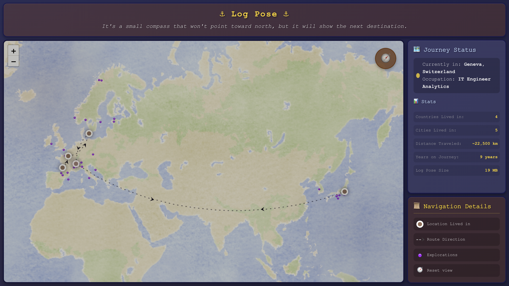

<br />
<div align="center">
    <br />
    <a href="https://log-pose-a0b2ccce9f1c.herokuapp.com/" style="font-size:22px;"><strong>Log Pose App</strong></a>
    <br />
    <a href="https://ch.linkedin.com/in/hugotorche">LinkedIn</a>
    &middot;
    <a href="https://github.com/hugotorche">GitHub</a>
    &middot;
    <a href="https://medium.com/p/550e0861389f">Medium</a>
  </p>
</div>

## About the App

I wanted to give a fresh look at some portfolio work I did few years ago. I decided to make it as a map. The purpose was to display my professional experience as a path and as an aventure, rather than just as a simple list.

Here are the main components:
* Leaflet map based on a Maptiler custom theme
* Node and Express lightweight framework to manage map token
* Advanced formating and animations using JS and CSS

The name Log Pose is inspired from One Piece, it's a compass that helps the navigators to find the next island to visit. I liked how the name is simple but also has an adventure and tech style.

## Visual Result
<div align="center">
  <a>
    
  </a>
</div>

### Built With

* Languages:
    * ![HTML]
    * ![CSS]
    * ![JavaScript]
* Frameworks:
    * [![Node][Node.js]][Node-url]
    * [![Express][Express.js]][Express-url]
* External Tools:
    * [![Heroku][Heroku.com]][Heroku-url]
    * [![Perplexity][Perplexity.ai]][Perplexity-url]

<p align="right">(<a href="#readme-top">back to top</a>)</p>

## Local commands

Below are the useful commands related to app run and deployment process:

* Install node-fetch
  ```sh
  /opt/homebrew/bin/npm install node-fetch
  ```
* Export the map token
  ```sh
  export MAP_TILE_TOKEN=map-tile-token
  ```
* Check the app size
  ```sh
  du -sh .
  ```
* Run the app locally
  ```sh
  /opt/homebrew/bin/node app.js
  ```
* Create Heroku app
  ```sh
  heroku create log-pose-app
  ```
* Deploy to Heroku
  ```sh
  git push heroku main
  ```
* Config Heroku variable
  ```sh
  heroku config:set MAP_TILE_TOKEN=map-tile-token
  ```

## Roadmap

- [x] Create first version of the app

<p align="right">(<a href="#readme-top">back to top</a>)</p>

<!-- MARKDOWN LINKS & IMAGES -->
[HTML]: https://img.shields.io/badge/HTML-%23E34F26.svg?logo=html5&logoColor=white
[CSS]: https://img.shields.io/badge/CSS-639?logo=css&logoColor=fff
[JavaScript]: https://img.shields.io/badge/JavaScript-F7DF1E?logo=javascript&logoColor=000
[Express.js]: https://img.shields.io/badge/Express.js-000000?logo=express&logoColor=fff&style=flat
[Express-url]: https://expressjs.com/
[Node.js]: https://img.shields.io/badge/node.js-339933?style=for-the-badge&logo=Node.js&logoColor=white
[Node-url]: https://nodejs.org/
[Perplexity.ai]: https://img.shields.io/badge/Perplexity-1FB8CD?logo=perplexity&logoColor=fff
[Perplexity-url]: https://perplexity.ai/
[Heroku.com]: https://img.shields.io/badge/Heroku-430098?logo=heroku&logoColor=fffe
[Heroku-url]: https://www.heroku.com/
